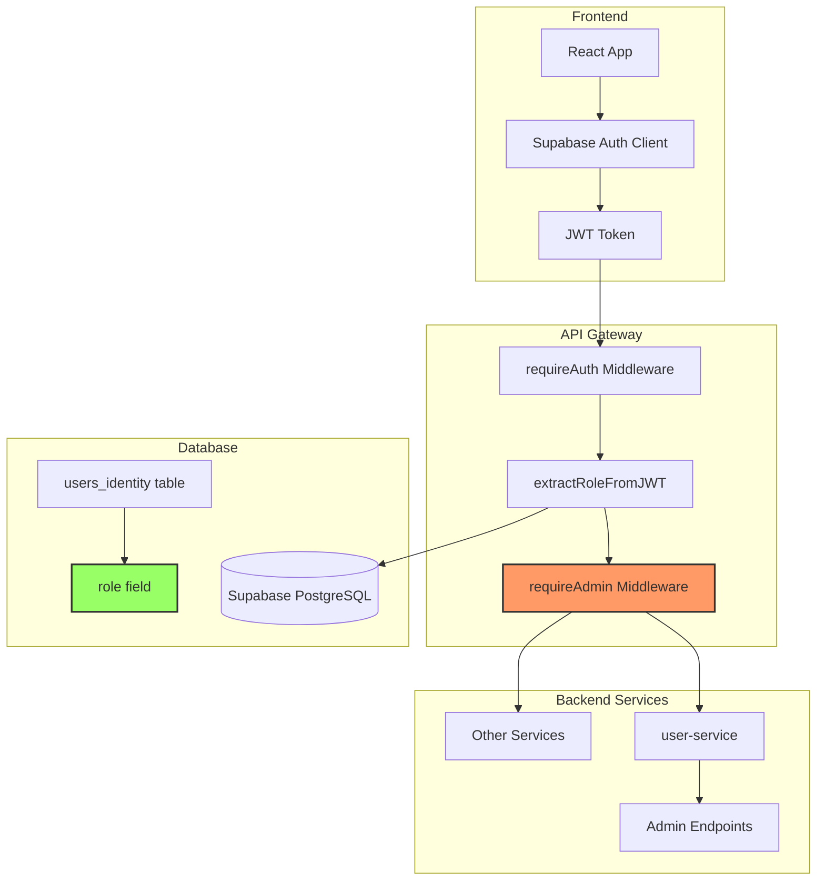
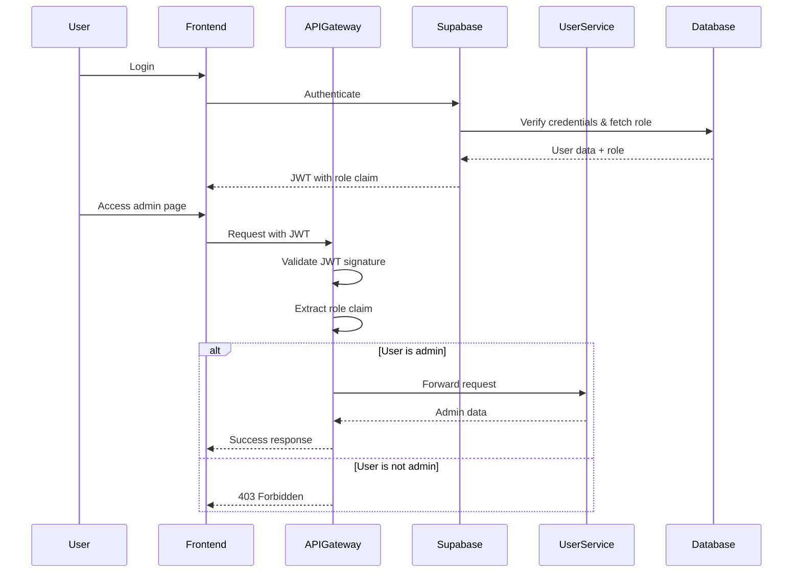
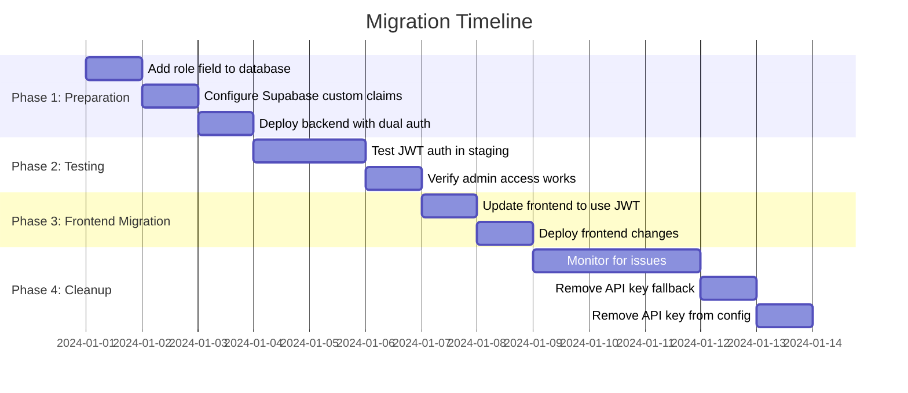

# Design Document: Role-Based Admin Authentication

## Overview

This design implements role-based admin authentication using Supabase Auth JWT tokens to replace the current insecure shared API key (`ADMIN_API_KEY`). The solution adds a role field to the user database schema, validates admin privileges through JWT token claims on the backend, and removes the exposed frontend API key that creates a security vulnerability.

### Current State

The system currently uses a shared API key approach:
- Backend services validate `ADMIN_API_KEY` environment variable
- Frontend sends `VITE_ADMIN_API_KEY` in `X-Admin-Secret` header
- Admin endpoints in `user-service` and `api-gateway-service` check this header
- Security vulnerability: API key exposed in frontend code and environment variables

### Target State

The new system will use JWT-based role verification:
- User role stored in `users_identity` table
- Supabase Auth includes role in JWT token claims via custom claims
- Backend extracts and validates role from JWT token
- Frontend uses existing Supabase auth token for all requests
- No shared secrets or API keys

### Key Benefits

1. **Security**: Eliminates shared secret exposed in frontend
2. **Scalability**: Role-based system supports future role expansion
3. **Simplicity**: Single authentication mechanism for all endpoints
4. **Auditability**: User-specific admin actions tied to individual accounts
5. **Standards Compliance**: Uses industry-standard JWT claims

## Architecture

### System Components



### Authentication Flow



### Data Flow

1. **User Login**: Supabase Auth validates credentials and queries `users_identity.role`
2. **JWT Generation**: Supabase includes role in JWT custom claims
3. **Request Authentication**: API Gateway validates JWT signature
4. **Role Extraction**: Middleware extracts role from JWT claims
5. **Authorization**: Middleware checks if role permits admin access
6. **Request Processing**: If authorized, request proceeds to backend service

## Components and Interfaces

### Database Schema Changes

#### users_identity Table Modification

Add role field to existing `users_identity` table:

```sql
-- Add role column with enum type for future extensibility
CREATE TYPE user_role AS ENUM ('user', 'admin');

ALTER TABLE users_identity 
ADD COLUMN role user_role NOT NULL DEFAULT 'user';

-- Create index for efficient role-based queries
CREATE INDEX idx_users_identity_role ON users_identity(role);

-- Add audit columns for role changes
ALTER TABLE users_identity
ADD COLUMN role_assigned_at TIMESTAMP NULL,
ADD COLUMN role_assigned_by TEXT NULL;
```

**Alternative: Boolean Approach** (simpler, less extensible)

```sql
ALTER TABLE users_identity 
ADD COLUMN is_admin BOOLEAN NOT NULL DEFAULT FALSE;

CREATE INDEX idx_users_identity_is_admin ON users_identity(is_admin);
```

**Recommendation**: Use enum approach for future role expansion (moderator, support, etc.)

#### Admin Audit Log Table

Track admin role assignments and changes:

```sql
CREATE TABLE admin_role_audit (
  id BIGSERIAL PRIMARY KEY,
  user_id TEXT NOT NULL REFERENCES users_identity(user_id),
  action TEXT NOT NULL, -- 'granted', 'revoked'
  previous_role user_role NULL,
  new_role user_role NOT NULL,
  assigned_by TEXT NULL, -- user_id of admin who made change
  reason TEXT NULL,
  created_at TIMESTAMP NOT NULL DEFAULT CURRENT_TIMESTAMP
);

CREATE INDEX idx_admin_audit_user ON admin_role_audit(user_id);
CREATE INDEX idx_admin_audit_created ON admin_role_audit(created_at DESC);
```

### Backend Components

#### 1. JWT Token Structure

Supabase JWT tokens will include custom claims:

```json
{
  "sub": "user-uuid-here",
  "email": "user@example.com",
  "role": "authenticated",
  "app_metadata": {
    "user_role": "admin"
  },
  "user_metadata": {},
  "aud": "authenticated",
  "exp": 1234567890,
  "iat": 1234567890
}
```

**Key Claims**:
- `sub`: Supabase user ID
- `app_metadata.user_role`: Custom role field from database
- `exp`: Token expiration timestamp

#### 2. Supabase Custom Claims Configuration

Configure Supabase to include role in JWT:

```sql
-- Create function to add custom claims
CREATE OR REPLACE FUNCTION public.custom_access_token_hook(event jsonb)
RETURNS jsonb
LANGUAGE plpgsql
AS $$
DECLARE
  claims jsonb;
  user_role text;
BEGIN
  -- Fetch the user role from users_identity
  SELECT role INTO user_role
  FROM public.users_identity
  WHERE supabase_user_id = (event->>'user_id')::text;

  claims := event->'claims';

  IF user_role IS NOT NULL THEN
    -- Set custom claim for user role
    claims := jsonb_set(claims, '{user_role}', to_jsonb(user_role));
  ELSE
    -- Default to 'user' if no role found
    claims := jsonb_set(claims, '{user_role}', '"user"');
  END IF;

  -- Update the 'claims' object in the original event
  event := jsonb_set(event, '{claims}', claims);

  RETURN event;
END;
$$;

-- Grant necessary permissions
GRANT USAGE ON SCHEMA public TO supabase_auth_admin;
GRANT SELECT ON public.users_identity TO supabase_auth_admin;
```

**Configure in Supabase Dashboard**:
1. Navigate to Authentication > Hooks
2. Enable "Custom Access Token" hook
3. Set hook function: `public.custom_access_token_hook`

#### 3. API Gateway Middleware

**New Middleware: `requireAdmin`**

```go
// AdminClaims represents the structure of admin-related JWT claims
type AdminClaims struct {
	UserRole string `json:"user_role"`
}

// extractRoleFromJWT extracts the user role from JWT token
func extractRoleFromJWT(token string) (string, error) {
	if !supabaseConfigured() {
		return "", errors.New("Supabase not configured")
	}

	url := supabaseBaseURL() + "/auth/v1/user"
	req, err := http.NewRequest("GET", url, nil)
	if err != nil {
		return "", err
	}

	req.Header.Set("Authorization", "Bearer "+token)
	req.Header.Set("apikey", supabaseAnonKey())

	client := &http.Client{Timeout: 10 * time.Second}
	resp, err := client.Do(req)
	if err != nil {
		return "", err
	}
	defer resp.Body.Close()

	if resp.StatusCode != http.StatusOK {
		return "", fmt.Errorf("failed to validate token: status %d", resp.StatusCode)
	}

	var userData struct {
		AppMetadata struct {
			UserRole string `json:"user_role"`
		} `json:"app_metadata"`
	}

	if err := json.NewDecoder(resp.Body).Decode(&userData); err != nil {
		return "", err
	}

	// Default to 'user' if role not found
	if userData.AppMetadata.UserRole == "" {
		return "user", nil
	}

	return userData.AppMetadata.UserRole, nil
}

// requireAdmin middleware checks if user has admin role
func requireAdmin(next http.HandlerFunc) http.HandlerFunc {
	return func(w http.ResponseWriter, r *http.Request) {
		auth := strings.TrimSpace(r.Header.Get("Authorization"))
		if !strings.HasPrefix(auth, "Bearer ") {
			writeJSON(w, http.StatusUnauthorized, map[string]any{
				"error": "authentication required",
			})
			return
		}

		token := strings.TrimSpace(strings.TrimPrefix(auth, "Bearer "))
		if token == "" {
			writeJSON(w, http.StatusUnauthorized, map[string]any{
				"error": "authentication required",
			})
			return
		}

		// Extract role from JWT
		role, err := extractRoleFromJWT(token)
		if err != nil {
			log.Printf("Failed to extract role from JWT: %v", err)
			writeJSON(w, http.StatusUnauthorized, map[string]any{
				"error": "authentication failed",
			})
			return
		}

		// Check if user has admin role
		if role != "admin" {
			log.Printf("Access denied: user role '%s' is not admin", role)
			writeJSON(w, http.StatusForbidden, map[string]any{
				"error": "insufficient permissions",
			})
			return
		}

		// User is admin, proceed with request
		next(w, r)
	}
}
```

**Apply Middleware to Admin Routes**:

```go
// In main.go route setup
mux.HandleFunc("/api/v1/admin/kyc", requireAdmin(proxyHandler))
mux.HandleFunc("/api/v1/admin/settings", requireAdmin(proxyHandler))
```

#### 4. User Service Changes

Remove API key validation from admin handlers:

**Before**:
```go
func adminKYCDecisionHandler(w http.ResponseWriter, r *http.Request) {
	adminSecret := strings.TrimSpace(os.Getenv("ADMIN_API_KEY"))
	if adminSecret == "" || strings.TrimSpace(r.Header.Get("X-Admin-Secret")) != adminSecret {
		respond(w, http.StatusUnauthorized, map[string]any{"error": "admin authentication failed"})
		return
	}
	// ... handler logic
}
```

**After**:
```go
func adminKYCDecisionHandler(w http.ResponseWriter, r *http.Request) {
	// Authentication and authorization handled by API Gateway middleware
	// Extract user ID from context if needed for audit logging
	
	// ... handler logic
}
```

**Add Audit Logging**:

```go
// logAdminAction logs admin actions for audit trail
func logAdminAction(userID, action, targetUserID string, details map[string]any) {
	log.Printf("ADMIN_ACTION: user=%s action=%s target=%s details=%v", 
		userID, action, targetUserID, details)
	
	// Optionally write to admin_role_audit table or separate audit log
}
```

### Frontend Components

#### 1. Remove API Key Usage

**Remove from Admin.tsx**:

```typescript
// BEFORE
const adminSecret = String(import.meta.env.VITE_ADMIN_API_KEY || '').trim();

fetch(url, {
  headers: {
    'Authorization': `Bearer ${token}`,
    'X-Admin-Secret': adminSecret,  // REMOVE THIS
  }
})

// AFTER
fetch(url, {
  headers: {
    'Authorization': `Bearer ${token}`,  // Only JWT token needed
  }
})
```

**Remove from Home.tsx**:

```typescript
// BEFORE
const adminSecret = String(import.meta.env.VITE_ADMIN_API_KEY || '').trim();

// AFTER
// Remove adminSecret variable entirely
```

#### 2. Admin Status Check

Create utility to check admin status from JWT:

```typescript
// src/utils/auth.ts

import { supabase } from './supabase';

export interface UserRole {
  isAdmin: boolean;
  role: string;
}

/**
 * Check if current user has admin role
 * Extracts role from JWT token claims
 */
export async function checkAdminStatus(): Promise<UserRole> {
  try {
    const { data: { user }, error } = await supabase.auth.getUser();
    
    if (error || !user) {
      return { isAdmin: false, role: 'user' };
    }

    // Extract role from app_metadata
    const userRole = user.app_metadata?.user_role || 'user';
    
    return {
      isAdmin: userRole === 'admin',
      role: userRole
    };
  } catch (error) {
    console.error('Failed to check admin status:', error);
    return { isAdmin: false, role: 'user' };
  }
}

/**
 * Hook for React components to check admin status
 */
export function useAdminStatus() {
  const [adminStatus, setAdminStatus] = React.useState<UserRole>({
    isAdmin: false,
    role: 'user'
  });
  const [loading, setLoading] = React.useState(true);

  React.useEffect(() => {
    checkAdminStatus().then(status => {
      setAdminStatus(status);
      setLoading(false);
    });

    // Listen for auth state changes
    const { data: { subscription } } = supabase.auth.onAuthStateChange(() => {
      checkAdminStatus().then(setAdminStatus);
    });

    return () => subscription.unsubscribe();
  }, []);

  return { ...adminStatus, loading };
}
```

#### 3. Update Admin Page

```typescript
// src/pages/Admin.tsx

import { useAdminStatus } from '../utils/auth';

export default function Admin() {
  const { isAdmin, loading } = useAdminStatus();
  const [kyc, setKyc] = useState([]);

  // Show loading state
  if (loading) {
    return <div>Loading...</div>;
  }

  // Show access denied if not admin
  if (!isAdmin) {
    return (
      <div className="bg-red-500/20 border border-red-400/50 text-red-100 px-4 py-3 rounded-xl">
        Access Denied: You do not have admin privileges.
      </div>
    );
  }

  // Admin UI
  return (
    <div>
      {/* Admin dashboard content */}
    </div>
  );
}
```

#### 4. Error Handling

```typescript
// src/utils/api.ts

export async function makeAdminRequest(endpoint: string, options: RequestInit = {}) {
  const { data: { session } } = await supabase.auth.getSession();
  
  if (!session) {
    throw new Error('Not authenticated');
  }

  const response = await fetch(`${API_BASE_URL}${endpoint}`, {
    ...options,
    headers: {
      'Authorization': `Bearer ${session.access_token}`,
      'Content-Type': 'application/json',
      ...options.headers,
    },
  });

  if (response.status === 401) {
    // Token expired, try to refresh
    const { data: { session: newSession } } = await supabase.auth.refreshSession();
    if (newSession) {
      // Retry with new token
      return makeAdminRequest(endpoint, options);
    }
    throw new Error('Authentication failed');
  }

  if (response.status === 403) {
    throw new Error('Insufficient permissions');
  }

  if (!response.ok) {
    throw new Error(`Request failed: ${response.statusText}`);
  }

  return response.json();
}
```

#### 5. Admin User Management Dashboard

**User List Component** (`src/pages/admin/Users.tsx`):

```typescript
import React, { useState, useEffect } from 'react';
import { makeAdminRequest } from '../../utils/api';

interface User {
  user_id: string;
  full_name: string;
  auth_email: string;
  phone_e164: string;
  role: 'user' | 'admin';
  status: 'active' | 'suspended' | 'deactivated';
  kyc_status?: 'pending' | 'approved' | 'rejected';
  created_at: string;
  last_login?: string;
}

export default function AdminUsers() {
  const [users, setUsers] = useState<User[]>([]);
  const [loading, setLoading] = useState(true);
  const [search, setSearch] = useState('');
  const [statusFilter, setStatusFilter] = useState('all');
  const [kycFilter, setKycFilter] = useState('all');
  const [page, setPage] = useState(1);
  const [totalPages, setTotalPages] = useState(1);

  const loadUsers = async () => {
    setLoading(true);
    try {
      const params = new URLSearchParams({
        page: page.toString(),
        limit: '20',
        ...(search && { search }),
        ...(statusFilter !== 'all' && { status: statusFilter }),
        ...(kycFilter !== 'all' && { kyc_status: kycFilter }),
      });

      const data = await makeAdminRequest(`/api/v1/admin/users?${params}`);
      setUsers(data.users || []);
      setTotalPages(data.totalPages || 1);
    } catch (error) {
      console.error('Failed to load users:', error);
    } finally {
      setLoading(false);
    }
  };

  useEffect(() => {
    loadUsers();
  }, [page, statusFilter, kycFilter]);

  const handleSearch = (e: React.FormEvent) => {
    e.preventDefault();
    setPage(1);
    loadUsers();
  };

  return (
    <div className="space-y-6">
      <div className="flex justify-between items-center">
        <h1 className="text-2xl font-bold text-white">User Management</h1>
      </div>

      {/* Search and Filters */}
      <div className="bg-white/10 backdrop-blur-md rounded-xl border border-white/20 p-4">
        <form onSubmit={handleSearch} className="flex gap-4">
          <input
            type="text"
            placeholder="Search by name, email, or phone..."
            value={search}
            onChange={(e) => setSearch(e.target.value)}
            className="flex-1 h-10 rounded-lg px-3 bg-white/95 text-slate-900"
          />
          <select
            value={statusFilter}
            onChange={(e) => setStatusFilter(e.target.value)}
            className="h-10 rounded-lg px-3 bg-white/95 text-slate-900"
          >
            <option value="all">All Status</option>
            <option value="active">Active</option>
            <option value="suspended">Suspended</option>
            <option value="deactivated">Deactivated</option>
          </select>
          <select
            value={kycFilter}
            onChange={(e) => setKycFilter(e.target.value)}
            className="h-10 rounded-lg px-3 bg-white/95 text-slate-900"
          >
            <option value="all">All KYC</option>
            <option value="pending">Pending</option>
            <option value="approved">Approved</option>
            <option value="rejected">Rejected</option>
          </select>
          <button
            type="submit"
            className="h-10 px-6 rounded-lg bg-blue-600 text-white font-semibold hover:bg-blue-700"
          >
            Search
          </button>
        </form>
      </div>

      {/* User List */}
      <div className="bg-white/10 backdrop-blur-md rounded-xl border border-white/20 overflow-hidden">
        {loading ? (
          <div className="p-8 text-center text-white">Loading...</div>
        ) : users.length === 0 ? (
          <div className="p-8 text-center text-white">No users found</div>
        ) : (
          <table className="w-full">
            <thead className="bg-white/5">
              <tr>
                <th className="px-4 py-3 text-left text-white font-semibold">User</th>
                <th className="px-4 py-3 text-left text-white font-semibold">Contact</th>
                <th className="px-4 py-3 text-left text-white font-semibold">Role</th>
                <th className="px-4 py-3 text-left text-white font-semibold">Status</th>
                <th className="px-4 py-3 text-left text-white font-semibold">KYC</th>
                <th className="px-4 py-3 text-left text-white font-semibold">Joined</th>
                <th className="px-4 py-3 text-right text-white font-semibold">Actions</th>
              </tr>
            </thead>
            <tbody>
              {users.map((user) => (
                <tr key={user.user_id} className="border-t border-white/10 hover:bg-white/5">
                  <td className="px-4 py-3 text-white">
                    <div className="font-semibold">{user.full_name}</div>
                    <div className="text-sm text-blue-200">{user.user_id}</div>
                  </td>
                  <td className="px-4 py-3 text-white">
                    <div className="text-sm">{user.auth_email}</div>
                    <div className="text-sm text-blue-200">{user.phone_e164}</div>
                  </td>
                  <td className="px-4 py-3">
                    <span className={`px-2 py-1 rounded text-xs font-semibold ${
                      user.role === 'admin' ? 'bg-purple-500 text-white' : 'bg-gray-500 text-white'
                    }`}>
                      {user.role}
                    </span>
                  </td>
                  <td className="px-4 py-3">
                    <span className={`px-2 py-1 rounded text-xs font-semibold ${
                      user.status === 'active' ? 'bg-green-500 text-white' :
                      user.status === 'suspended' ? 'bg-yellow-500 text-white' :
                      'bg-red-500 text-white'
                    }`}>
                      {user.status}
                    </span>
                  </td>
                  <td className="px-4 py-3">
                    {user.kyc_status && (
                      <span className={`px-2 py-1 rounded text-xs font-semibold ${
                        user.kyc_status === 'approved' ? 'bg-green-500 text-white' :
                        user.kyc_status === 'pending' ? 'bg-yellow-500 text-white' :
                        'bg-red-500 text-white'
                      }`}>
                        {user.kyc_status}
                      </span>
                    )}
                  </td>
                  <td className="px-4 py-3 text-white text-sm">
                    {new Date(user.created_at).toLocaleDateString()}
                  </td>
                  <td className="px-4 py-3 text-right">
                    <button
                      onClick={() => window.location.href = `/admin/users/${user.user_id}`}
                      className="px-3 py-1 rounded bg-blue-600 text-white text-sm hover:bg-blue-700"
                    >
                      View
                    </button>
                  </td>
                </tr>
              ))}
            </tbody>
          </table>
        )}

        {/* Pagination */}
        {totalPages > 1 && (
          <div className="p-4 flex justify-center gap-2 border-t border-white/10">
            <button
              onClick={() => setPage(p => Math.max(1, p - 1))}
              disabled={page === 1}
              className="px-4 py-2 rounded bg-white/10 text-white disabled:opacity-50"
            >
              Previous
            </button>
            <span className="px-4 py-2 text-white">
              Page {page} of {totalPages}
            </span>
            <button
              onClick={() => setPage(p => Math.min(totalPages, p + 1))}
              disabled={page === totalPages}
              className="px-4 py-2 rounded bg-white/10 text-white disabled:opacity-50"
            >
              Next
            </button>
          </div>
        )}
      </div>
    </div>
  );
}
```

**User Detail Component** (`src/pages/admin/UserDetail.tsx`):

```typescript
import React, { useState, useEffect } from 'react';
import { useParams } from 'react-router-dom';
import { makeAdminRequest } from '../../utils/api';

interface UserDetail {
  user_id: string;
  full_name: string;
  auth_email: string;
  phone_e164: string;
  role: 'user' | 'admin';
  status: 'active' | 'suspended' | 'deactivated';
  kyc_status?: 'pending' | 'approved' | 'rejected';
  created_at: string;
  last_login?: string;
  role_assigned_at?: string;
  role_assigned_by?: string;
}

interface ActivityLog {
  id: string;
  action: string;
  timestamp: string;
  details: string;
  ip_address?: string;
}

export default function AdminUserDetail() {
  const { userId } = useParams<{ userId: string }>();
  const [user, setUser] = useState<UserDetail | null>(null);
  const [activity, setActivity] = useState<ActivityLog[]>([]);
  const [loading, setLoading] = useState(true);
  const [showStatusModal, setShowStatusModal] = useState(false);
  const [showRoleModal, setShowRoleModal] = useState(false);

  const loadUser = async () => {
    try {
      const data = await makeAdminRequest(`/api/v1/admin/users/${userId}`);
      setUser(data.user);
    } catch (error) {
      console.error('Failed to load user:', error);
    }
  };

  const loadActivity = async () => {
    try {
      const data = await makeAdminRequest(`/api/v1/admin/users/${userId}/activity`);
      setActivity(data.activity || []);
    } catch (error) {
      console.error('Failed to load activity:', error);
    }
  };

  useEffect(() => {
    Promise.all([loadUser(), loadActivity()]).finally(() => setLoading(false));
  }, [userId]);

  const handleStatusChange = async (newStatus: string, reason: string) => {
    try {
      await makeAdminRequest(`/api/v1/admin/users/${userId}/status`, {
        method: 'PATCH',
        body: JSON.stringify({ status: newStatus, reason }),
      });
      await loadUser();
      setShowStatusModal(false);
    } catch (error) {
      console.error('Failed to update status:', error);
    }
  };

  const handleRoleChange = async (newRole: string) => {
    try {
      await makeAdminRequest(`/api/v1/admin/users/${userId}/role`, {
        method: 'PATCH',
        body: JSON.stringify({ role: newRole }),
      });
      await loadUser();
      setShowRoleModal(false);
    } catch (error) {
      console.error('Failed to update role:', error);
    }
  };

  const handlePasswordReset = async () => {
    if (!confirm('Send password reset email to this user?')) return;
    
    try {
      await makeAdminRequest(`/api/v1/admin/users/${userId}/reset-password`, {
        method: 'POST',
      });
      alert('Password reset email sent');
    } catch (error) {
      console.error('Failed to reset password:', error);
    }
  };

  if (loading) {
    return <div className="text-white">Loading...</div>;
  }

  if (!user) {
    return <div className="text-white">User not found</div>;
  }

  return (
    <div className="space-y-6">
      {/* User Header */}
      <div className="bg-white/10 backdrop-blur-md rounded-xl border border-white/20 p-6">
        <div className="flex justify-between items-start">
          <div>
            <h1 className="text-2xl font-bold text-white">{user.full_name}</h1>
            <p className="text-blue-200">{user.user_id}</p>
          </div>
          <div className="flex gap-2">
            <button
              onClick={() => setShowStatusModal(true)}
              className="px-4 py-2 rounded-lg bg-yellow-600 text-white hover:bg-yellow-700"
            >
              Change Status
            </button>
            <button
              onClick={() => setShowRoleModal(true)}
              className="px-4 py-2 rounded-lg bg-purple-600 text-white hover:bg-purple-700"
            >
              Change Role
            </button>
            <button
              onClick={handlePasswordReset}
              className="px-4 py-2 rounded-lg bg-blue-600 text-white hover:bg-blue-700"
            >
              Reset Password
            </button>
          </div>
        </div>

        <div className="grid grid-cols-2 md:grid-cols-4 gap-4 mt-6">
          <div>
            <div className="text-blue-200 text-sm">Email</div>
            <div className="text-white font-semibold">{user.auth_email}</div>
          </div>
          <div>
            <div className="text-blue-200 text-sm">Phone</div>
            <div className="text-white font-semibold">{user.phone_e164}</div>
          </div>
          <div>
            <div className="text-blue-200 text-sm">Role</div>
            <div className="text-white font-semibold">{user.role}</div>
          </div>
          <div>
            <div className="text-blue-200 text-sm">Status</div>
            <div className="text-white font-semibold">{user.status}</div>
          </div>
          <div>
            <div className="text-blue-200 text-sm">KYC Status</div>
            <div className="text-white font-semibold">{user.kyc_status || 'N/A'}</div>
          </div>
          <div>
            <div className="text-blue-200 text-sm">Joined</div>
            <div className="text-white font-semibold">
              {new Date(user.created_at).toLocaleDateString()}
            </div>
          </div>
          <div>
            <div className="text-blue-200 text-sm">Last Login</div>
            <div className="text-white font-semibold">
              {user.last_login ? new Date(user.last_login).toLocaleDateString() : 'Never'}
            </div>
          </div>
        </div>
      </div>

      {/* Activity Log */}
      <div className="bg-white/10 backdrop-blur-md rounded-xl border border-white/20 p-6">
        <h2 className="text-xl font-bold text-white mb-4">Activity Log</h2>
        <div className="space-y-3">
          {activity.length === 0 ? (
            <div className="text-blue-200">No activity recorded</div>
          ) : (
            activity.map((log) => (
              <div key={log.id} className="border-l-2 border-blue-500 pl-4 py-2">
                <div className="text-white font-semibold">{log.action}</div>
                <div className="text-blue-200 text-sm">{log.details}</div>
                <div className="text-blue-300 text-xs mt-1">
                  {new Date(log.timestamp).toLocaleString()}
                  {log.ip_address && ` • ${log.ip_address}`}
                </div>
              </div>
            ))
          )}
        </div>
      </div>

      {/* Modals would go here */}
    </div>
  );
}
```

## Data Models

### User Identity with Role

```typescript
interface UserIdentity {
  user_id: string;
  full_name: string;
  phone_e164: string;
  auth_email: string;
  contact_email?: string;
  supabase_user_id?: string;
  supabase_login_email?: string;
  role: 'user' | 'admin';  // NEW FIELD
  role_assigned_at?: Date;  // NEW FIELD
  role_assigned_by?: string;  // NEW FIELD
  status: string;
  created_at: Date;
  updated_at: Date;
}
```

### Admin Audit Log Entry

```typescript
interface AdminRoleAudit {
  id: number;
  user_id: string;
  action: 'granted' | 'revoked';
  previous_role?: 'user' | 'admin';
  new_role: 'user' | 'admin';
  assigned_by?: string;
  reason?: string;
  created_at: Date;
}
```

### JWT Token Claims

```typescript
interface SupabaseJWTClaims {
  sub: string;  // User ID
  email: string;
  role: 'authenticated' | 'anon';
  app_metadata: {
    user_role: 'user' | 'admin';  // Custom claim
  };
  user_metadata: Record<string, any>;
  aud: string;
  exp: number;
  iat: number;
}
```


## Correctness Properties

*A property is a characteristic or behavior that should hold true across all valid executions of a system—essentially, a formal statement about what the system should do. Properties serve as the bridge between human-readable specifications and machine-verifiable correctness guarantees.*

### Property Reflection

After analyzing the acceptance criteria, I identified the following testable properties. Many requirements are infrastructure setup (SMOKE tests), specific examples (EXAMPLE tests), or integration checks (INTEGRATION tests) rather than universal properties suitable for property-based testing.

**Properties identified for PBT:**
1. JWT validation for admin endpoints (3.1)
2. Role extraction from valid JWTs (3.2)
3. Admin authorization success (3.3)
4. Non-admin authorization rejection (3.4)
5. Invalid token rejection (3.5)
6. Admin route protection (3.6)
7. Admin assignment endpoint protection (6.2)
8. Error response sanitization (9.2)
9. Error response consistency (9.5)

**Redundancy Analysis:**
- Properties 3.3, 3.4, 3.5 can be combined into a comprehensive authorization property
- Property 3.6 is a specific case of the combined authorization property
- Property 6.2 is also covered by the authorization property
- Properties 9.2 and 9.5 can be combined into error handling property

**Final Properties (after removing redundancy):**

### Property 1: Admin Endpoint Authorization

*For any* admin endpoint request, the system SHALL enforce role-based authorization where:
- Requests with valid admin JWT tokens receive 2xx responses
- Requests with valid non-admin JWT tokens receive 403 Forbidden
- Requests with invalid or missing JWT tokens receive 401 Unauthorized

**Validates: Requirements 3.1, 3.2, 3.3, 3.4, 3.5, 3.6, 6.2**

### Property 2: JWT Role Extraction Consistency

*For any* valid JWT token containing a role claim, extracting the role SHALL return the exact role value from the token's app_metadata without database queries.

**Validates: Requirements 2.2, 3.2**

### Property 3: Error Response Sanitization

*For any* authentication or authorization failure, the error response SHALL:
- Use consistent JSON structure
- Contain only generic error messages
- NOT include role information, user details, or internal system information

**Validates: Requirements 9.1, 9.2, 9.5**

### Property 4: Admin Route Pattern Protection

*For any* HTTP endpoint matching the pattern `/api/v1/admin/*`, the system SHALL apply admin role verification regardless of the specific endpoint path or HTTP method.

**Validates: Requirements 3.6**

## Error Handling

### Authentication Errors

**Invalid JWT Token**:
- Status: 401 Unauthorized
- Response: `{"error": "authentication required"}`
- Logging: Log token validation failure with error details (not in response)

**Missing JWT Token**:
- Status: 401 Unauthorized
- Response: `{"error": "authentication required"}`
- Logging: Log missing token attempt

**Expired JWT Token**:
- Status: 401 Unauthorized
- Response: `{"error": "authentication required"}`
- Logging: Log token expiration
- Frontend: Automatically refresh token and retry

### Authorization Errors

**Insufficient Permissions**:
- Status: 403 Forbidden
- Response: `{"error": "insufficient permissions"}`
- Logging: Log user ID, attempted endpoint, and role (detailed logging for security monitoring)
- Frontend: Display "Access Denied" message

**Multiple Failed Attempts**:
- Logging: Log security event after 5 failed authorization attempts from same user within 5 minutes
- Response: Same 403 response (don't leak rate limiting info)

### Database Errors

**Role Assignment to Non-Existent User**:
- Status: 404 Not Found
- Response: `{"error": "user not found"}`
- Logging: Log attempted assignment with target user ID

**Database Connection Failure**:
- Status: 503 Service Unavailable
- Response: `{"error": "service temporarily unavailable"}`
- Logging: Log database error details

### Migration Phase Errors

**Both Auth Methods Fail**:
- Status: 401 Unauthorized
- Response: `{"error": "authentication required"}`
- Logging: Log both JWT and API key validation failures

### Error Handling Principles

1. **Never leak sensitive information**: Error responses should be generic
2. **Log detailed information**: Internal logs should contain full context for debugging
3. **Consistent structure**: All errors use same JSON format
4. **Security monitoring**: Track patterns of authorization failures
5. **User-friendly messages**: Frontend translates error codes to helpful messages

## Testing Strategy

### Overview

This feature requires a comprehensive testing approach combining:
- **Unit tests**: Specific logic components (JWT extraction, role validation)
- **Integration tests**: End-to-end flows with real Supabase instance
- **Property-based tests**: Universal authorization properties
- **Smoke tests**: Configuration and setup verification

Property-based testing is appropriate for authorization logic because:
- Authorization rules should hold for ALL valid inputs (any endpoint, any token)
- Input space is large (many endpoints, many possible tokens)
- We're testing OUR authorization logic, not external services
- Tests can use mocks to avoid expensive external calls

### Unit Tests

**JWT Role Extraction** (`services/api-gateway-service/auth_test.go`):
```go
func TestExtractRoleFromJWT(t *testing.T) {
	tests := []struct{
		name string
		token string
		expectedRole string
		expectError bool
	}{
		{"admin role", mockAdminToken(), "admin", false},
		{"user role", mockUserToken(), "user", false},
		{"missing role defaults to user", mockTokenWithoutRole(), "user", false},
		{"invalid token", "invalid", "", true},
	}
	// ... test implementation
}
```

**Admin Middleware** (`services/api-gateway-service/middleware_test.go`):
```go
func TestRequireAdminMiddleware(t *testing.T) {
	tests := []struct{
		name string
		token string
		expectedStatus int
	}{
		{"admin token succeeds", mockAdminToken(), 200},
		{"user token forbidden", mockUserToken(), 403},
		{"no token unauthorized", "", 401},
		{"invalid token unauthorized", "invalid", 401},
	}
	// ... test implementation
}
```

### Integration Tests

**End-to-End Admin Flow** (`services/api-gateway-service/integration_test.go`):
```go
func TestAdminEndpointIntegration(t *testing.T) {
	// Setup: Create test users with different roles in Supabase
	adminUser := createTestUser(t, "admin")
	regularUser := createTestUser(t, "user")
	
	// Test: Admin user can access admin endpoints
	resp := makeRequest(t, "/api/v1/admin/kyc", adminUser.token)
	assert.Equal(t, 200, resp.StatusCode)
	
	// Test: Regular user cannot access admin endpoints
	resp = makeRequest(t, "/api/v1/admin/kyc", regularUser.token)
	assert.Equal(t, 403, resp.StatusCode)
	
	// Test: Unauthenticated request rejected
	resp = makeRequest(t, "/api/v1/admin/kyc", "")
	assert.Equal(t, 401, resp.StatusCode)
}
```

**Supabase Custom Claims** (`db/migrations/test_custom_claims.sql`):
```sql
-- Test that custom claims hook adds role to JWT
BEGIN;
  -- Create test user with admin role
  INSERT INTO users_identity (user_id, full_name, phone_e164, auth_email, role)
  VALUES ('test_admin', 'Test Admin', '+256700000001', 'admin@test.com', 'admin');
  
  -- Verify custom claims hook would include role
  -- (This requires Supabase test environment)
ROLLBACK;
```

### Property-Based Tests

**Test Framework**: Use `gopter` for Go property-based testing

**Property 1: Admin Endpoint Authorization** (`services/api-gateway-service/properties_test.go`):
```go
// Feature: role-based-admin-auth, Property 1: Admin Endpoint Authorization
func TestProperty_AdminEndpointAuthorization(t *testing.T) {
	parameters := gopter.DefaultTestParameters()
	parameters.MinSuccessfulTests = 100
	
	properties := gopter.NewProperties(parameters)
	
	properties.Property("admin endpoints enforce role-based authorization", 
		prop.ForAll(
			func(endpoint string, role string, tokenValid bool) bool {
				// Generate request with specified characteristics
				token := generateToken(role, tokenValid)
				resp := makeTestRequest(endpoint, token)
				
				// Verify authorization behavior
				if !tokenValid {
					return resp.StatusCode == 401
				}
				if role == "admin" {
					return resp.StatusCode >= 200 && resp.StatusCode < 300
				}
				return resp.StatusCode == 403
			},
			genAdminEndpoint(),  // Generator for /api/v1/admin/* paths
			gen.OneConstOf("admin", "user"),  // Role generator
			gen.Bool(),  // Token validity generator
		))
	
	properties.TestingRun(t)
}
```

**Property 2: JWT Role Extraction** (`services/api-gateway-service/properties_test.go`):
```go
// Feature: role-based-admin-auth, Property 2: JWT Role Extraction Consistency
func TestProperty_JWTRoleExtraction(t *testing.T) {
	parameters := gopter.DefaultTestParameters()
	parameters.MinSuccessfulTests = 100
	
	properties := gopter.NewProperties(parameters)
	
	properties.Property("role extraction returns exact token role value",
		prop.ForAll(
			func(role string) bool {
				// Generate valid token with specified role
				token := generateValidTokenWithRole(role)
				
				// Extract role (should not query database)
				extractedRole, err := extractRoleFromJWT(token)
				
				// Verify extraction matches token
				return err == nil && extractedRole == role
			},
			gen.OneConstOf("admin", "user", "moderator"),  // Role generator
		))
	
	properties.TestingRun(t)
}
```

**Property 3: Error Response Sanitization** (`services/api-gateway-service/properties_test.go`):
```go
// Feature: role-based-admin-auth, Property 3: Error Response Sanitization
func TestProperty_ErrorResponseSanitization(t *testing.T) {
	parameters := gopter.DefaultTestParameters()
	parameters.MinSuccessfulTests = 100
	
	properties := gopter.NewProperties(parameters)
	
	properties.Property("error responses never leak sensitive information",
		prop.ForAll(
			func(endpoint string, token string) bool {
				// Make request that will fail auth/authz
				resp := makeTestRequest(endpoint, token)
				
				// Parse error response
				var errorResp map[string]interface{}
				json.NewDecoder(resp.Body).Decode(&errorResp)
				
				// Verify no sensitive data in response
				responseStr := fmt.Sprintf("%v", errorResp)
				return !containsSensitiveData(responseStr) &&
					   hasConsistentStructure(errorResp)
			},
			genAdminEndpoint(),
			genInvalidToken(),  // Generator for various invalid tokens
		))
	
	properties.TestingRun(t)
}

func containsSensitiveData(response string) bool {
	sensitivePatterns := []string{
		"user_id", "role", "admin", "user", 
		"database", "query", "internal",
	}
	for _, pattern := range sensitivePatterns {
		if strings.Contains(strings.ToLower(response), pattern) {
			return true
		}
	}
	return false
}
```

**Property 4: Admin Route Pattern Protection** (`services/api-gateway-service/properties_test.go`):
```go
// Feature: role-based-admin-auth, Property 4: Admin Route Pattern Protection
func TestProperty_AdminRoutePatternProtection(t *testing.T) {
	parameters := gopter.DefaultTestParameters()
	parameters.MinSuccessfulTests = 100
	
	properties := gopter.NewProperties(parameters)
	
	properties.Property("all /api/v1/admin/* routes require admin role",
		prop.ForAll(
			func(subpath string, method string) bool {
				endpoint := "/api/v1/admin/" + subpath
				userToken := generateValidTokenWithRole("user")
				
				// Make request with non-admin token
				resp := makeTestRequestWithMethod(endpoint, method, userToken)
				
				// Should always return 403 for non-admin
				return resp.StatusCode == 403
			},
			genURLPath(),  // Generator for various subpaths
			gen.OneConstOf("GET", "POST", "PUT", "PATCH", "DELETE"),
		))
	
	properties.TestingRun(t)
}
```

### Smoke Tests

**Configuration Verification** (`scripts/verify_migration.sh`):
```bash
#!/bin/bash
# Verify API key removed from codebase

echo "Checking for ADMIN_API_KEY references..."
if grep -r "ADMIN_API_KEY" services/ src/ --exclude-dir=node_modules; then
  echo "ERROR: Found ADMIN_API_KEY references"
  exit 1
fi

echo "Checking for VITE_ADMIN_API_KEY references..."
if grep -r "VITE_ADMIN_API_KEY" src/ --exclude-dir=node_modules; then
  echo "ERROR: Found VITE_ADMIN_API_KEY references"
  exit 1
fi

echo "Checking for X-Admin-Secret header usage..."
if grep -r "X-Admin-Secret" services/ src/ --exclude-dir=node_modules; then
  echo "ERROR: Found X-Admin-Secret header usage"
  exit 1
fi

echo "✓ Migration verification passed"
```

**Database Schema Verification** (`db/migrations/verify_schema.sql`):
```sql
-- Verify role field exists with correct type
DO $$
BEGIN
  IF NOT EXISTS (
    SELECT 1 FROM information_schema.columns 
    WHERE table_name = 'users_identity' AND column_name = 'role'
  ) THEN
    RAISE EXCEPTION 'role column missing from users_identity table';
  END IF;
  
  IF NOT EXISTS (
    SELECT 1 FROM information_schema.columns 
    WHERE table_name = 'users_identity' 
      AND column_name = 'role'
      AND data_type = 'USER-DEFINED'
      AND udt_name = 'user_role'
  ) THEN
    RAISE EXCEPTION 'role column has incorrect type';
  END IF;
END $$;
```

### Test Coverage Requirements

- **Unit tests**: Minimum 80% code coverage for auth middleware
- **Integration tests**: Cover all admin endpoints
- **Property tests**: Minimum 100 iterations per property
- **Smoke tests**: Run as part of CI/CD pipeline

### Testing Tools

- **Go testing**: Standard `testing` package
- **Property-based testing**: `gopter` library
- **HTTP testing**: `httptest` package
- **Mocking**: `gomock` for Supabase client mocks
- **Frontend testing**: Vitest + React Testing Library
- **E2E testing**: Playwright (optional, for full user flows)


## Migration Strategy

### Overview

The migration from API key to JWT-based authentication requires careful coordination to avoid service disruption. This strategy provides a phased approach with backward compatibility.

### Migration Phases



### Phase 1: Database and Backend Preparation

**Step 1.1: Database Migration**

Create and run migration script:

```sql
-- File: db/migrations/012_add_user_roles.sql

-- Create enum type for roles
CREATE TYPE user_role AS ENUM ('user', 'admin');

-- Add role column with default
ALTER TABLE users_identity 
ADD COLUMN role user_role NOT NULL DEFAULT 'user',
ADD COLUMN role_assigned_at TIMESTAMP NULL,
ADD COLUMN role_assigned_by TEXT NULL;

-- Create index for role queries
CREATE INDEX idx_users_identity_role ON users_identity(role);

-- Create audit table
CREATE TABLE admin_role_audit (
  id BIGSERIAL PRIMARY KEY,
  user_id TEXT NOT NULL REFERENCES users_identity(user_id),
  action TEXT NOT NULL,
  previous_role user_role NULL,
  new_role user_role NOT NULL,
  assigned_by TEXT NULL,
  reason TEXT NULL,
  created_at TIMESTAMP NOT NULL DEFAULT CURRENT_TIMESTAMP
);

CREATE INDEX idx_admin_audit_user ON admin_role_audit(user_id);
CREATE INDEX idx_admin_audit_created ON admin_role_audit(created_at DESC);

-- Function to log role changes
CREATE OR REPLACE FUNCTION log_role_change()
RETURNS TRIGGER AS $$
BEGIN
  IF (TG_OP = 'UPDATE' AND OLD.role IS DISTINCT FROM NEW.role) THEN
    INSERT INTO admin_role_audit (user_id, action, previous_role, new_role, assigned_by)
    VALUES (
      NEW.user_id,
      CASE WHEN NEW.role = 'admin' THEN 'granted' ELSE 'revoked' END,
      OLD.role,
      NEW.role,
      NEW.role_assigned_by
    );
  END IF;
  RETURN NEW;
END;
$$ LANGUAGE plpgsql;

-- Trigger for automatic audit logging
CREATE TRIGGER trigger_log_role_change
AFTER UPDATE ON users_identity
FOR EACH ROW
EXECUTE FUNCTION log_role_change();
```

**Step 1.2: Assign Initial Admin Roles**

Create SQL script to assign admin role to specific users:

```sql
-- File: db/scripts/assign_admin_roles.sql

-- Assign admin role by email
UPDATE users_identity
SET 
  role = 'admin',
  role_assigned_at = CURRENT_TIMESTAMP,
  role_assigned_by = 'system_migration'
WHERE auth_email IN (
  'admin1@example.com',
  'admin2@example.com'
  -- Add other admin emails
);

-- Verify assignments
SELECT user_id, full_name, auth_email, role, role_assigned_at
FROM users_identity
WHERE role = 'admin';
```

**Step 1.3: Configure Supabase Custom Claims**

```sql
-- File: db/migrations/013_configure_custom_claims.sql

-- Create custom access token hook function
CREATE OR REPLACE FUNCTION public.custom_access_token_hook(event jsonb)
RETURNS jsonb
LANGUAGE plpgsql
SECURITY DEFINER
SET search_path = public
AS $$
DECLARE
  claims jsonb;
  user_role text;
BEGIN
  -- Fetch the user role from users_identity
  SELECT role INTO user_role
  FROM public.users_identity
  WHERE supabase_user_id = (event->>'user_id')::text;

  claims := event->'claims';

  IF user_role IS NOT NULL THEN
    -- Set custom claim for user role
    claims := jsonb_set(claims, '{user_role}', to_jsonb(user_role));
  ELSE
    -- Default to 'user' if no role found
    claims := jsonb_set(claims, '{user_role}', '"user"');
  END IF;

  -- Update the 'claims' object in the original event
  event := jsonb_set(event, '{claims}', claims);

  RETURN event;
END;
$$;

-- Grant necessary permissions
GRANT USAGE ON SCHEMA public TO supabase_auth_admin;
GRANT SELECT ON public.users_identity TO supabase_auth_admin;
GRANT EXECUTE ON FUNCTION public.custom_access_token_hook TO supabase_auth_admin;
```

**Configure in Supabase Dashboard**:
1. Go to Authentication > Hooks
2. Enable "Custom Access Token" hook
3. Set function: `public.custom_access_token_hook`
4. Save configuration

**Step 1.4: Deploy Backend with Dual Authentication**

Add feature flag for migration mode:

```go
// File: services/api-gateway-service/main.go

// Migration mode allows both JWT and API key authentication
func isMigrationMode() bool {
	return strings.ToLower(os.Getenv("AUTH_MIGRATION_MODE")) == "true"
}

// requireAdminWithFallback supports both auth methods during migration
func requireAdminWithFallback(next http.HandlerFunc) http.HandlerFunc {
	return func(w http.ResponseWriter, r *http.Request) {
		// Try JWT authentication first
		auth := strings.TrimSpace(r.Header.Get("Authorization"))
		if strings.HasPrefix(auth, "Bearer ") {
			token := strings.TrimPrefix(auth, "Bearer ")
			role, err := extractRoleFromJWT(token)
			
			if err == nil && role == "admin" {
				log.Printf("AUTH_METHOD: jwt, user_role: admin")
				next(w, r)
				return
			}
			
			// JWT auth failed, try fallback if in migration mode
			if !isMigrationMode() {
				writeJSON(w, http.StatusForbidden, map[string]any{
					"error": "insufficient permissions",
				})
				return
			}
		}
		
		// Fallback to API key (only in migration mode)
		if isMigrationMode() {
			adminSecret := strings.TrimSpace(os.Getenv("ADMIN_API_KEY"))
			if adminSecret != "" && strings.TrimSpace(r.Header.Get("X-Admin-Secret")) == adminSecret {
				log.Printf("AUTH_METHOD: api_key (fallback)")
				next(w, r)
				return
			}
		}
		
		// Both methods failed
		writeJSON(w, http.StatusUnauthorized, map[string]any{
			"error": "authentication required",
		})
	}
}

// Update route registration
func setupRoutes() *http.ServeMux {
	mux := http.NewServeMux()
	
	// Admin routes with migration support
	mux.HandleFunc("/api/v1/admin/kyc", requireAdminWithFallback(proxyHandler))
	mux.HandleFunc("/api/v1/admin/settings", requireAdminWithFallback(proxyHandler))
	
	return mux
}
```

**Environment Configuration**:
```bash
# .env
AUTH_MIGRATION_MODE=true  # Enable during migration
ADMIN_API_KEY=existing_key  # Keep temporarily for fallback
```

### Phase 2: Testing and Validation

**Step 2.1: Staging Environment Testing**

```bash
# Test JWT authentication
curl -X GET https://staging-api.example.com/api/v1/admin/kyc \
  -H "Authorization: Bearer <admin_jwt_token>"
# Expected: 200 OK

# Test non-admin JWT
curl -X GET https://staging-api.example.com/api/v1/admin/kyc \
  -H "Authorization: Bearer <user_jwt_token>"
# Expected: 403 Forbidden

# Test API key fallback (migration mode)
curl -X GET https://staging-api.example.com/api/v1/admin/kyc \
  -H "X-Admin-Secret: <api_key>"
# Expected: 200 OK (fallback works)
```

**Step 2.2: Verify Custom Claims**

```javascript
// Test script to verify JWT contains role claim
const { createClient } = require('@supabase/supabase-js');

const supabase = createClient(
  process.env.SUPABASE_URL,
  process.env.SUPABASE_ANON_KEY
);

async function testCustomClaims() {
  // Login as admin user
  const { data, error } = await supabase.auth.signInWithPassword({
    email: 'admin@example.com',
    password: 'test_password'
  });
  
  if (error) {
    console.error('Login failed:', error);
    return;
  }
  
  // Decode JWT to check claims
  const token = data.session.access_token;
  const payload = JSON.parse(atob(token.split('.')[1]));
  
  console.log('JWT Claims:', payload);
  console.log('User Role:', payload.user_role);
  
  if (payload.user_role === 'admin') {
    console.log('✓ Custom claims working correctly');
  } else {
    console.error('✗ Custom claims not working');
  }
}

testCustomClaims();
```

### Phase 3: Frontend Migration

**Step 3.1: Update Frontend Code**

Remove API key usage and update to JWT-only:

```typescript
// File: src/utils/api.ts

import { supabase } from './supabase';

const API_BASE_URL = import.meta.env.VITE_API_BASE_URL || 'http://localhost:8080';

export async function makeAdminRequest(
  endpoint: string,
  options: RequestInit = {}
): Promise<any> {
  // Get current session
  const { data: { session }, error } = await supabase.auth.getSession();
  
  if (error || !session) {
    throw new Error('Not authenticated');
  }

  // Make request with JWT token only
  const response = await fetch(`${API_BASE_URL}${endpoint}`, {
    ...options,
    headers: {
      'Authorization': `Bearer ${session.access_token}`,
      'Content-Type': 'application/json',
      ...options.headers,
    },
  });

  // Handle token expiration
  if (response.status === 401) {
    const { data: { session: newSession } } = await supabase.auth.refreshSession();
    if (newSession) {
      // Retry with new token
      return makeAdminRequest(endpoint, options);
    }
    throw new Error('Authentication failed');
  }

  // Handle authorization failure
  if (response.status === 403) {
    throw new Error('Insufficient permissions');
  }

  if (!response.ok) {
    throw new Error(`Request failed: ${response.statusText}`);
  }

  return response.json();
}
```

**Step 3.2: Update Admin Components**

```typescript
// File: src/pages/Admin.tsx

import { useAdminStatus } from '../utils/auth';
import { makeAdminRequest } from '../utils/api';

export default function Admin() {
  const { isAdmin, loading } = useAdminStatus();
  const [kyc, setKyc] = useState([]);

  const loadKyc = async () => {
    try {
      const data = await makeAdminRequest('/api/v1/admin/kyc');
      setKyc(data);
    } catch (error) {
      console.error('Failed to load KYC data:', error);
      // Show error message to user
    }
  };

  if (loading) {
    return <div>Loading...</div>;
  }

  if (!isAdmin) {
    return (
      <div className="bg-red-500/20 border border-red-400/50 text-red-100 px-4 py-3 rounded-xl">
        Access Denied: You do not have admin privileges.
      </div>
    );
  }

  return (
    <div>
      {/* Admin dashboard */}
    </div>
  );
}
```

**Step 3.3: Remove API Key References**

```bash
# Remove from .env
sed -i '/VITE_ADMIN_API_KEY/d' .env
sed -i '/VITE_ADMIN_API_KEY/d' .env.example

# Verify removal
grep -r "VITE_ADMIN_API_KEY" src/
# Should return no results
```

**Step 3.4: Deploy Frontend**

```bash
# Build frontend
npm run build

# Deploy to hosting
# (deployment method depends on hosting provider)
```

### Phase 4: Cleanup and Finalization

**Step 4.1: Monitor Production**

Monitor logs for 3-7 days to ensure JWT authentication is working:

```bash
# Check authentication method usage
grep "AUTH_METHOD" /var/log/api-gateway.log | sort | uniq -c

# Expected output after migration:
# 1000 AUTH_METHOD: jwt, user_role: admin
# 0 AUTH_METHOD: api_key (fallback)
```

**Step 4.2: Remove API Key Fallback**

Once JWT authentication is confirmed working:

```go
// File: services/api-gateway-service/main.go

// Remove requireAdminWithFallback, use requireAdmin only
func setupRoutes() *http.ServeMux {
	mux := http.NewServeMux()
	
	// Admin routes with JWT-only authentication
	mux.HandleFunc("/api/v1/admin/kyc", requireAdmin(proxyHandler))
	mux.HandleFunc("/api/v1/admin/settings", requireAdmin(proxyHandler))
	
	return mux
}

// Remove isMigrationMode() function
// Remove requireAdminWithFallback() function
```

**Step 4.3: Remove API Key from Configuration**

```bash
# Remove from .env
sed -i '/ADMIN_API_KEY/d' .env
sed -i '/AUTH_MIGRATION_MODE/d' .env

# Remove from .env.example
sed -i '/ADMIN_API_KEY/d' .env.example
sed -i '/AUTH_MIGRATION_MODE/d' .env.example

# Verify removal from codebase
grep -r "ADMIN_API_KEY" services/
# Should return no results
```

**Step 4.4: Update Documentation**

Create migration completion documentation:

```markdown
# Admin Authentication Migration - Completed

## Summary
Successfully migrated from shared API key to JWT-based role authentication.

## Changes Made
1. Added `role` field to `users_identity` table
2. Configured Supabase custom claims to include role in JWT
3. Implemented JWT-based admin authorization middleware
4. Updated frontend to use JWT tokens only
5. Removed all API key references

## Admin Role Assignment
To assign admin role to a user:

\`\`\`sql
UPDATE users_identity
SET 
  role = 'admin',
  role_assigned_at = CURRENT_TIMESTAMP,
  role_assigned_by = '<your_user_id>'
WHERE auth_email = 'user@example.com';
\`\`\`

## Verification
- All admin endpoints require valid JWT with admin role
- Non-admin users receive 403 Forbidden
- Invalid/missing tokens receive 401 Unauthorized
- Role changes are logged in `admin_role_audit` table

## Rollback Plan
If issues arise, rollback steps are documented in ROLLBACK.md
```

### Rollback Plan

In case of critical issues during migration:

**Rollback Step 1: Re-enable API Key**

```bash
# Set environment variables
export AUTH_MIGRATION_MODE=true
export ADMIN_API_KEY=<original_key>

# Restart services
systemctl restart api-gateway
```

**Rollback Step 2: Revert Frontend**

```bash
# Deploy previous frontend version
git checkout <previous_commit>
npm run build
# Deploy
```

**Rollback Step 3: Database Rollback (if needed)**

```sql
-- Only if database changes cause issues
ALTER TABLE users_identity DROP COLUMN IF EXISTS role;
ALTER TABLE users_identity DROP COLUMN IF EXISTS role_assigned_at;
ALTER TABLE users_identity DROP COLUMN IF EXISTS role_assigned_by;
DROP TABLE IF EXISTS admin_role_audit;
DROP TYPE IF EXISTS user_role;
DROP FUNCTION IF EXISTS log_role_change();
DROP FUNCTION IF EXISTS custom_access_token_hook(jsonb);
```

### Migration Checklist

- [ ] Phase 1: Preparation
  - [ ] Run database migration (add role field)
  - [ ] Assign admin roles to initial users
  - [ ] Configure Supabase custom claims hook
  - [ ] Deploy backend with dual auth support
  - [ ] Set AUTH_MIGRATION_MODE=true
- [ ] Phase 2: Testing
  - [ ] Test JWT authentication in staging
  - [ ] Verify custom claims in JWT tokens
  - [ ] Test admin access with JWT
  - [ ] Test non-admin rejection
  - [ ] Verify API key fallback works
- [ ] Phase 3: Frontend Migration
  - [ ] Update frontend code to use JWT only
  - [ ] Remove VITE_ADMIN_API_KEY references
  - [ ] Test admin pages in staging
  - [ ] Deploy frontend to production
- [ ] Phase 4: Cleanup
  - [ ] Monitor production for 3-7 days
  - [ ] Verify no API key fallback usage
  - [ ] Remove API key fallback code
  - [ ] Remove ADMIN_API_KEY from config
  - [ ] Set AUTH_MIGRATION_MODE=false
  - [ ] Update documentation
  - [ ] Run verification smoke tests

## Implementation Details

### File Changes Summary

**Backend Changes**:
- `db/migrations/012_add_user_roles.sql` - Add role field and audit table
- `db/migrations/013_configure_custom_claims.sql` - Configure Supabase hook
- `db/scripts/assign_admin_roles.sql` - Initial admin role assignments
- `services/api-gateway-service/main.go` - Add requireAdmin middleware
- `services/api-gateway-service/auth.go` - Add extractRoleFromJWT function
- `services/user-service/handlers.go` - Remove API key validation
- `services/api-gateway-service/auth_test.go` - Unit tests
- `services/api-gateway-service/properties_test.go` - Property-based tests
- `services/api-gateway-service/integration_test.go` - Integration tests

**Frontend Changes**:
- `src/utils/auth.ts` - Add checkAdminStatus and useAdminStatus
- `src/utils/api.ts` - Add makeAdminRequest helper
- `src/pages/Admin.tsx` - Update to use JWT-only auth
- `src/pages/Home.tsx` - Remove API key usage
- `.env` - Remove VITE_ADMIN_API_KEY
- `.env.example` - Remove VITE_ADMIN_API_KEY

**Documentation**:
- `docs/ADMIN_AUTH_MIGRATION.md` - Migration guide
- `docs/ADMIN_ROLE_ASSIGNMENT.md` - How to assign admin roles
- `docs/ROLLBACK.md` - Rollback procedures

### Dependencies

**Backend**:
- No new dependencies required
- Uses existing Supabase client libraries

**Frontend**:
- `@supabase/supabase-js` (already installed)
- No new dependencies required

**Testing**:
- `gopter` - Property-based testing for Go
- `gomock` - Mocking for unit tests
- `httptest` - HTTP testing (standard library)

### Performance Considerations

**JWT Validation**:
- JWT validation requires HTTP call to Supabase `/auth/v1/user` endpoint
- Response time: ~50-100ms
- Consider caching JWT validation results with short TTL (30-60 seconds)
- Supabase handles JWT signature verification

**Database Queries**:
- Custom claims hook queries `users_identity` table on token generation
- Index on `supabase_user_id` ensures fast lookups
- Token generation happens only on login/refresh (infrequent)

**Caching Strategy** (optional optimization):

```go
// Cache JWT validation results to reduce Supabase API calls
type jwtCache struct {
	mu    sync.RWMutex
	cache map[string]cacheEntry
}

type cacheEntry struct {
	role      string
	expiresAt time.Time
}

var jwtValidationCache = &jwtCache{
	cache: make(map[string]cacheEntry),
}

func extractRoleFromJWTWithCache(token string) (string, error) {
	// Check cache first
	jwtValidationCache.mu.RLock()
	if entry, ok := jwtValidationCache.cache[token]; ok {
		if time.Now().Before(entry.expiresAt) {
			jwtValidationCache.mu.RUnlock()
			return entry.role, nil
		}
	}
	jwtValidationCache.mu.RUnlock()
	
	// Cache miss or expired, validate with Supabase
	role, err := extractRoleFromJWT(token)
	if err != nil {
		return "", err
	}
	
	// Cache result for 60 seconds
	jwtValidationCache.mu.Lock()
	jwtValidationCache.cache[token] = cacheEntry{
		role:      role,
		expiresAt: time.Now().Add(60 * time.Second),
	}
	jwtValidationCache.mu.Unlock()
	
	return role, nil
}
```

### Security Considerations

**JWT Token Security**:
- Tokens transmitted over HTTPS only
- Tokens stored in memory (not localStorage to prevent XSS)
- Short token expiration (1 hour default)
- Automatic token refresh on expiration

**Role Assignment Security**:
- Admin role assignment requires database access (not exposed via API initially)
- All role changes logged in audit table
- Consider implementing admin-only endpoint for role management (future enhancement)

**Error Message Security**:
- Generic error messages prevent information leakage
- Detailed errors logged server-side only
- No role or user information in error responses

**Rate Limiting** (recommended):
```go
// Add rate limiting for admin endpoints
func rateLimitMiddleware(next http.HandlerFunc) http.HandlerFunc {
	limiter := rate.NewLimiter(rate.Limit(10), 20) // 10 req/sec, burst 20
	
	return func(w http.ResponseWriter, r *http.Request) {
		if !limiter.Allow() {
			writeJSON(w, http.StatusTooManyRequests, map[string]any{
				"error": "rate limit exceeded",
			})
			return
		}
		next(w, r)
	}
}
```

## Conclusion

This design provides a comprehensive, secure, and maintainable solution for role-based admin authentication. The migration strategy ensures zero downtime and provides rollback capabilities. The testing strategy combines unit, integration, and property-based tests for thorough coverage.

Key benefits of this implementation:
1. **Security**: Eliminates shared secret vulnerability
2. **Scalability**: Role-based system supports future expansion
3. **Maintainability**: Single authentication mechanism
4. **Auditability**: Complete audit trail of admin actions
5. **Standards Compliance**: Uses industry-standard JWT claims

The phased migration approach minimizes risk while the comprehensive testing strategy ensures correctness across all scenarios.
