# Tayosa Ecosystem

**Tayosa** is a SACCO-oriented banking and savings platform for Uganda. This monorepo hosts the **Tayosa Ecosystem**: a **Go** microservice backend behind an **API gateway**, a **React + Vite + TypeScript** web client, a **Flutter** mobile app, SQL **migrations** for platform identity and ledgers, and integration with **[InsForge](https://insforge.app)** for hosted authentication, optional cloud Postgres, and object storage.

**Upstream repository:** [github.com/tayosainfo/tayosaecosystem](https://github.com/tayosainfo/tayosaecosystem)

---

## Contents

- [Architecture](#architecture)
- [Repository layout](#repository-layout)
- [Backend services](#backend-services)
- [Web application](#web-application)
- [Mobile application](#mobile-application)
- [Data and migrations](#data-and-migrations)
- [Environment configuration](#environment-configuration)
- [Prerequisites](#prerequisites)
- [Quick start](#quick-start)
- [Authentication and email verification](#authentication-and-email-verification)
- [API surface (gateway)](#api-surface-gateway)
- [Scripts](#scripts)
- [Documentation](#documentation)
- [License and support](#license-and-support)

---

## Architecture

Clients talk to **`api-gateway-service`** (default port **8080**). The gateway forwards requests to small **Go** services by path prefix. **`user-service`** owns identity, onboarding phases, Uganda geo lookups, and InsForge-backed auth (register, login, email verification, password reset, OAuth helpers, profile).

```mermaid
flowchart LR
  subgraph clients [Clients]
    Web[Vite React]
    Mobile[Flutter]
  end
  GW[api-gateway :8080]
  US[user-service :8081]
  ST[object-storage :8015]
  AF[affiliate :8016]
  NT[notification :8010]
  AU[audit :8014]
  LN[loan-credit :8013]
  FE[fee :8004]
  KB[kibiina :8086]
  IF[(InsForge)]
  PG[(Postgres)]

  Web --> GW
  Mobile --> GW
  GW --> US
  GW --> ST
  GW --> AF
  GW --> NT
  GW --> AU
  GW --> LN
  GW --> FE
  GW --> KB
  US --> IF
  US --> PG
  ST --> IF
```

---

## Repository layout

| Path | Description |
|------|-------------|
| [`services/`](services/) | Independent Go modules per service (`go.mod` in each folder). |
| [`src/`](src/) | Web SPA: auth pages, `AuthContext`, `platformApi` client to the gateway. |
| [`app/mobile_app/`](app/mobile_app/) | Flutter app (Android, iOS, web targets). |
| [`db/migrations/`](db/migrations/) | Ordered SQL migrations for `users_identity`, onboarding, shares ledger, etc. |
| [`db/insforge_run_on_dashboard.sql`](db/insforge_run_on_dashboard.sql) | Optional SQL to run from InsForge SQL editor when applicable. |
| [`docs/`](docs/) | Runbooks, HTTP contracts, auth strategy, InsForge wiring. |
| [`scripts/`](scripts/) | `build-backend.sh` / `build-backend.ps1` to compile all Go services. |
| [`docker-compose.yml`](docker-compose.yml) | Local **Postgres 15** for development (optional). |
| [`.env.example`](.env.example) | Template for root `.env` (copy to `.env`; **never commit** `.env`). |
| [`uganda_geo_data_2025-11-26.csv`](uganda_geo_data_2025-11-26.csv) | Geo hierarchy seed data consumed by `user-service`. |

---

## Backend services

| Service | Default port | Role |
|---------|--------------|------|
| **api-gateway-service** | 8080 | Single HTTP entry; CORS; proxies to services below. |
| **user-service** | 8081 | Auth, `users/me`, onboarding phase, `/geo`, group policy; InsForge + Postgres. |
| **object-storage-service** | 8015 | Upload strategy / storage proxy toward InsForge. |
| **affiliate-service** | 8016 | Referrals and rewards. |
| **notification-service** | 8010 | Outbound notifications. |
| **audit-log-service** | 8014 | Append-only audit API. |
| **loan-credit-service** | 8013 | Loan scoring placeholder / API surface. |
| **fee-service** | 8004 | Fee-related API (`PORT` overridable). |
| **kibiina-service** | 8086 | Group / merry-go-round flows (`PORT` overridable). |

Each service is started with `go run .` from its directory (or run compiled binaries). **`user-service`** and **`api-gateway-service`** load the **repo root** `.env` via `godotenv` (see runbook).

---

## Web application

- **Stack:** React 18, TypeScript, Vite 6, Tailwind CSS, `@insforge/sdk` (where used), `lucide-react`.
- **Dev server:** `npm run dev` (default Vite port **5173**).
- **Production build:** `npm run build` → output in `dist/`.
- **Env:** `VITE_API_BASE_URL` (gateway, default `http://localhost:8080`), `VITE_INSFORGE_BASE_URL` / `VITE_INSFORGE_ANON_KEY` when the UI should align with InsForge web behavior (e.g. required signup email and verification redirect).

**Routes (path-based in [`src/App.tsx`](src/App.tsx)):** login (`/`), email verification (`/verify`), registration (`/register`), forgot/reset password. Authenticated shell is minimal while the product UI is rebuilt around InsForge-backed flows.

---

## Mobile application

- **Path:** [`app/mobile_app/`](app/mobile_app/)
- **Commands:** `flutter pub get` then `flutter run` (device or emulator).
- **Networking:** Base URL for the gateway is configured in [`lib/core/network/api_client.dart`](app/mobile_app/lib/core/network/api_client.dart) (local defaults documented in the runbook).

---

## Data and migrations

1. Choose **Postgres**: local Docker (`docker compose up -d postgres`) or InsForge-hosted DB (connection string from the InsForge dashboard while the project is **active**).
2. Apply migrations in order under [`db/migrations/`](db/migrations/) (`001` … `007` and any newer files).
3. Keep the **Uganda geo CSV** at the **repository root**; `user-service` uses it when seeding geo units.

Details: [`docs/RUNBOOK_LOCAL_DEVELOPMENT.md`](docs/RUNBOOK_LOCAL_DEVELOPMENT.md), [`docs/USER_SERVICE_DATA_AND_AUTH.md`](docs/USER_SERVICE_DATA_AND_AUTH.md).

---

## Environment configuration

1. Copy **`.env.example`** to **`.env`** at the repo root.
2. Set at least:
   - **`INSFORGE_BASE_URL`** / **`INSFORGE_ANON_KEY`** — live InsForge auth (omit both to use in-memory / dev auth paths in `user-service`).
   - **`DATABASE_URL`** (or **`CONNECTION_STRING`**) — Postgres for identities and onboarding; optional **`USER_SERVICE_ALLOW_MEMORY_FALLBACK=1`** if you must run without DB.
   - Gateway service URLs (**`USER_SERVICE_URL`**, etc.) if not using localhost defaults.
3. For the **Vite** app, mirror InsForge URL/anon key if needed: **`VITE_INSFORGE_BASE_URL`**, **`VITE_INSFORGE_ANON_KEY`**, **`VITE_API_BASE_URL`**.

Optional **`INSFORGE_ADMIN_API_KEY`** helps resolve InsForge user IDs when sign-up JSON omits `user.id`. Full commentary: [`.env.example`](.env.example) and [`docs/INSFORGE_CONNECTION_SETUP.md`](docs/INSFORGE_CONNECTION_SETUP.md).

**Security:** `.env` is **gitignored**. Do not commit secrets, database passwords, or GitHub tokens. Use your platform’s secret store for CI/CD.

---

## Prerequisites

| Tool | Notes |
|------|--------|
| **Go** | 1.22+ (see each service’s `go.mod`). |
| **Node.js** | 18+ and npm (web). |
| **Flutter** | 3.24+ (mobile). |
| **Docker** | Optional; for local Postgres only. |

---

## Quick start

1. **Clone** this repository and `cd` into it.
2. **`.env`** — Copy `.env.example` → `.env` and fill values (see above).
3. **Database** — Start Postgres if needed (`docker compose up -d postgres`), then apply [`db/migrations/`](db/migrations/).
4. **Backend** — From repo root, either:
   - `npm run backend:build` (Windows PowerShell), or  
   - `./scripts/build-backend.sh` (Unix), then run each service binary **or** `go run .` per service (see runbook for order; start **user-service** then **api-gateway** for auth smoke tests).
5. **Web** — `npm install` then `npm run dev`.
6. **Mobile** — `cd app/mobile_app` → `flutter pub get` → `flutter run`.

**Smoke test ideas:** register → verify email (if InsForge email is configured) → login → `GET /api/v1/geo?level=district` → authenticated onboarding phase update. See [`docs/RUNBOOK_LOCAL_DEVELOPMENT.md`](docs/RUNBOOK_LOCAL_DEVELOPMENT.md) §4.

---

## Authentication and email verification

- With **InsForge** enabled, `user-service` delegates sign-up, sessions, verification, and password reset to InsForge’s REST API (same patterns as `@insforge/sdk`).
- **Email verification:** Outbound mail must be configured in the **InsForge project** (SMTP / provider). Otherwise verification resend/create-token calls will fail on InsForge’s side.
- **Pending local profile:** If sign-up completes in InsForge before a full Tayosa row exists, the web flow can send users to **`/verify`** with profile completion; see [`docs/AUTH_IDENTITY_AND_LOGIN_STRATEGY.md`](docs/AUTH_IDENTITY_AND_LOGIN_STRATEGY.md).

---

## API surface (gateway)

All paths below are relative to the gateway (e.g. `http://localhost:8080`). **`public: false`** routes require `Authorization: Bearer <access_token>`.

**Public (auth / geo):**  
`/api/v1/auth/register`, `login`, `resend-verification-email`, `verify-email`, `send-reset-password-email`, `exchange-reset-password-token`, `reset-password`, `oauth/start`, `oauth/exchange`, `refresh`, `logout`, `public-config`, **`GET`** `/api/v1/geo`, `/api/v1/groups/policy`.

**Authenticated:**  
`/api/v1/auth/profile` (**PATCH**), `/api/v1/users/me`, `/api/v1/onboarding/phase`, storage, affiliate, notifications, audit, loans, fees, kibiina — see [`docs/SERVICE_CONTRACTS.md`](docs/SERVICE_CONTRACTS.md) for shapes and methods.

---

## Scripts

| Script | Purpose |
|--------|---------|
| [`scripts/build-backend.ps1`](scripts/build-backend.ps1) | Build all Go services on Windows (`npm run backend:build`). |
| [`scripts/build-backend.sh`](scripts/build-backend.sh) | Same on macOS/Linux. |
| [`test_unified_auth_flow.js`](test_unified_auth_flow.js), [`test_unverified_login.js`](test_unverified_login.js) | Ad-hoc Node scripts for local auth experiments (run with Node as needed). |

---

## Documentation

| Document | Topic |
|----------|--------|
| [`docs/RUNBOOK_LOCAL_DEVELOPMENT.md`](docs/RUNBOOK_LOCAL_DEVELOPMENT.md) | Ports, start order, smoke tests, troubleshooting. |
| [`docs/SERVICE_CONTRACTS.md`](docs/SERVICE_CONTRACTS.md) | Gateway routing and HTTP contracts. |
| [`docs/ARCHITECTURE_WORKFLOW.md`](docs/ARCHITECTURE_WORKFLOW.md) | Target workflows (onboarding, Kibiina). |
| [`docs/AUTH_IDENTITY_AND_LOGIN_STRATEGY.md`](docs/AUTH_IDENTITY_AND_LOGIN_STRATEGY.md) | Identity model and auth strategy. |
| [`docs/INSFORGE_CONNECTION_SETUP.md`](docs/INSFORGE_CONNECTION_SETUP.md) | InsForge env vars, admin key, MCP checks. |
| [`docs/USER_SERVICE_DATA_AND_AUTH.md`](docs/USER_SERVICE_DATA_AND_AUTH.md) | User-service data model and auth behavior. |
| [`AGENTS.md`](AGENTS.md) | Notes for AI coding agents working in this repo. |

---

## License and support

- **License:** Proprietary software owned by **TAYOSA GROUP (U) LTD.**
- **Support:** [tech@tayosa.ug](mailto:tech@tayosa.ug)

---

*README version aligned with the Tayosa Ecosystem monorepo; for the latest file tree and scripts, browse [the repository on GitHub](https://github.com/tayosainfo/tayosaecosystem).*
