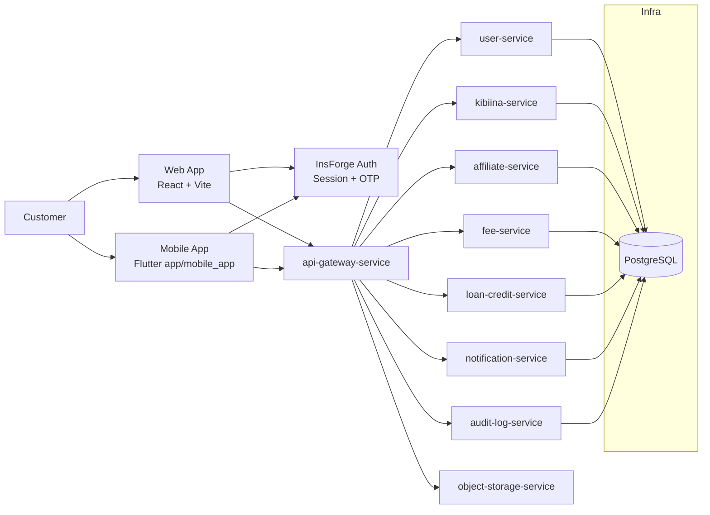
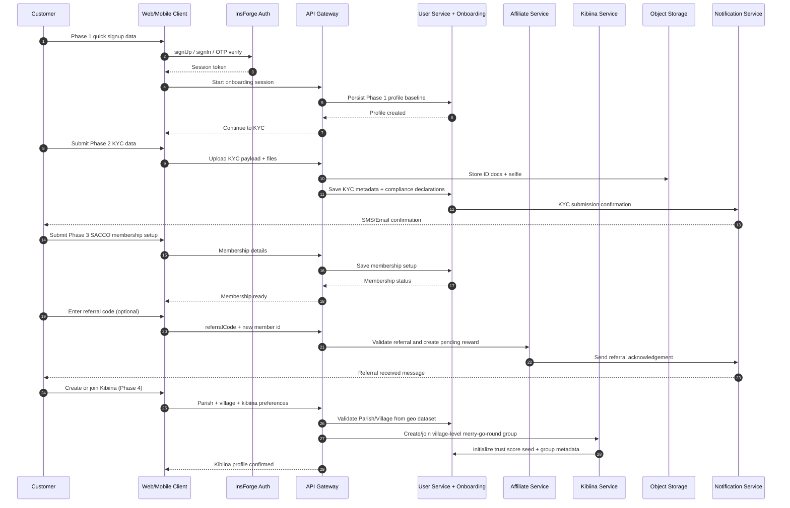

# SACCO Target Architecture And Workflow

This document reflects the active direction after removing `auth-service`:
- InsForge handles authentication/session/OTP.
- Platform services handle onboarding, SACCO membership, and Kibiina flows.
- API Gateway is the enforced entry point for clients.
- Uganda geo hierarchy uses `uganda_geo_data_2025-11-26.csv` as onboarding reference data.

## High-Level Architecture

## Registration And Onboarding Workflow

## Geographic And Group Model Rules

- Parish is the SACCO boundary unit.
- A single parish-level SACCO can contain unlimited village-level Kibiina groups.
- New villages can be added over time by ingesting updates to `uganda_geo_data_2025-11-26.csv`.
- Onboarding address selectors should cascade: `District -> County -> Sub-County -> Parish -> Village`.
- Kibiina creation must require both parish and village IDs to enforce jurisdiction and reporting.

